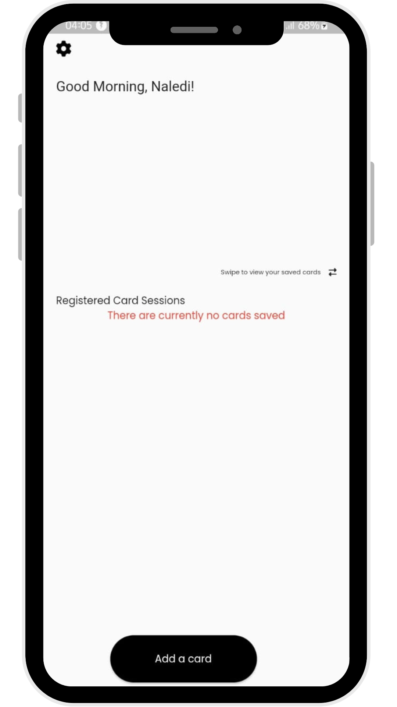
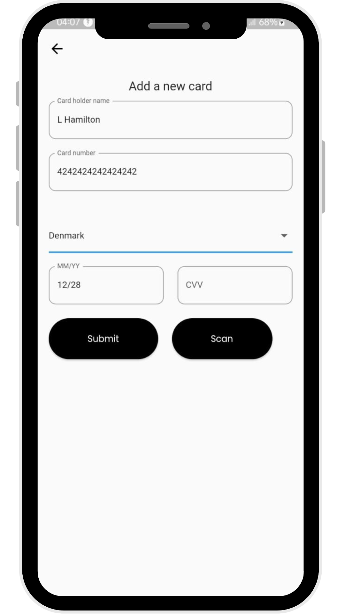
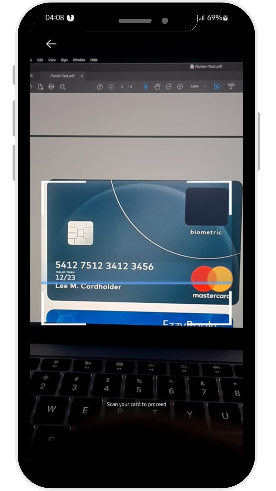
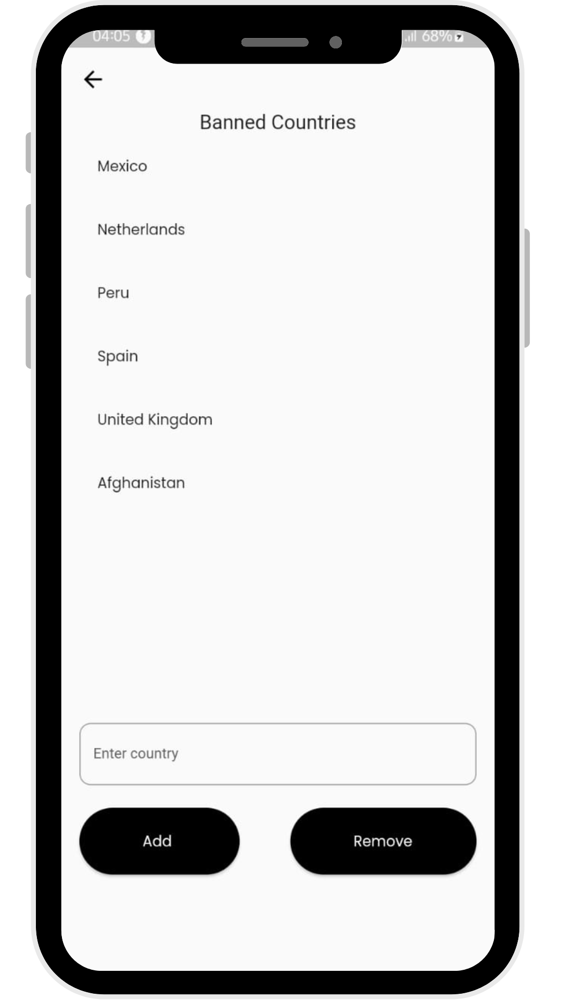
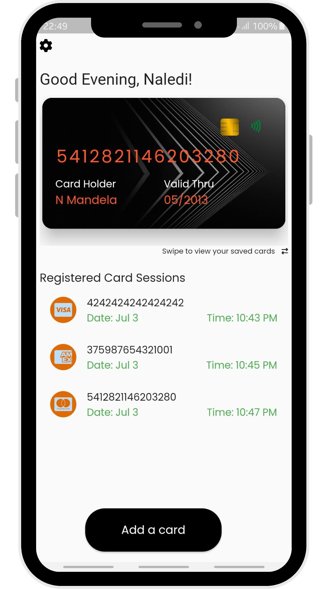

# Card Check

![coverage][coverage_badge]
[![style: very good analysis][very_good_analysis_badge]][very_good_analysis_link]
[![License: MIT][license_badge]][license_link]

Bootstrapped by the [Very Good CLI][very_good_cli_link] 🤖

A RankGroup interview assignment.
- Capture card details menually and via scanning (Card Number, Expiry Date, CVV, Card Holder)
- Infer card type /provider 
- Capture card storing sessions, by date and time 
---

<p align="middle">
  
   
    
</p>

<p align="middle">
  
   
</p>

<p align = "middle">
   
</p>

## Getting Started 🚀

This project contains 3 flavors:

- development
- staging
- production

To run the desired flavor either use the launch configuration in VSCode/Android Studio or use the following commands:

```sh
# Development
$ flutter run --flavor development --target lib/main_development.dart

# Staging
$ flutter run --flavor staging --target lib/main_staging.dart

# Production
$ flutter run --flavor production --target lib/main_production.dart
```

_\*Card Check works on iOS, Android, Web, and Windows._

---

## Running Tests 🧪

To run all unit and widget tests use the following command:

```sh
$ dart test  /file name under test folder
```

---
## The installable to this project can be found here 
https://drive.google.com/file/d/113q2-BBQ0ERttU9HoqzOIsrgpnreUv9J/view?usp=sharing
```
```

[coverage_badge]: coverage_badge.svg
[flutter_localizations_link]: https://api.flutter.dev/flutter/flutter_localizations/flutter_localizations-library.html
[internationalization_link]: https://flutter.dev/docs/development/accessibility-and-localization/internationalization
[license_badge]: https://img.shields.io/badge/license-MIT-blue.svg
[license_link]: https://opensource.org/licenses/MIT
[very_good_analysis_badge]: https://img.shields.io/badge/style-very_good_analysis-B22C89.svg
[very_good_analysis_link]: https://pub.dev/packages/very_good_analysis
[very_good_cli_link]: https://github.com/VeryGoodOpenSource/very_good_cli
